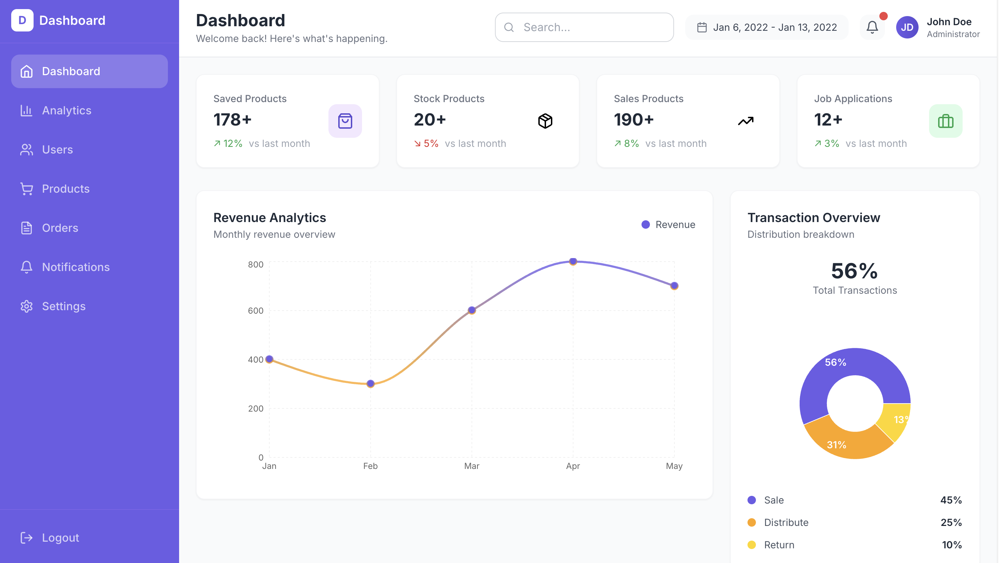
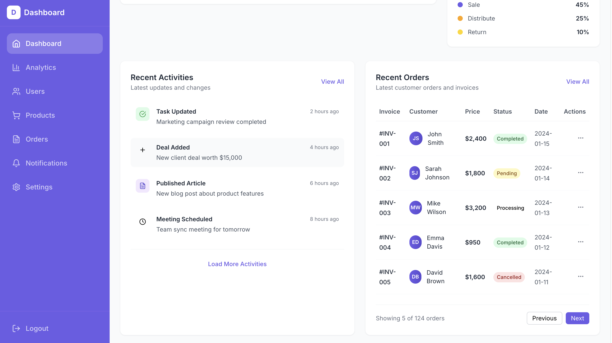
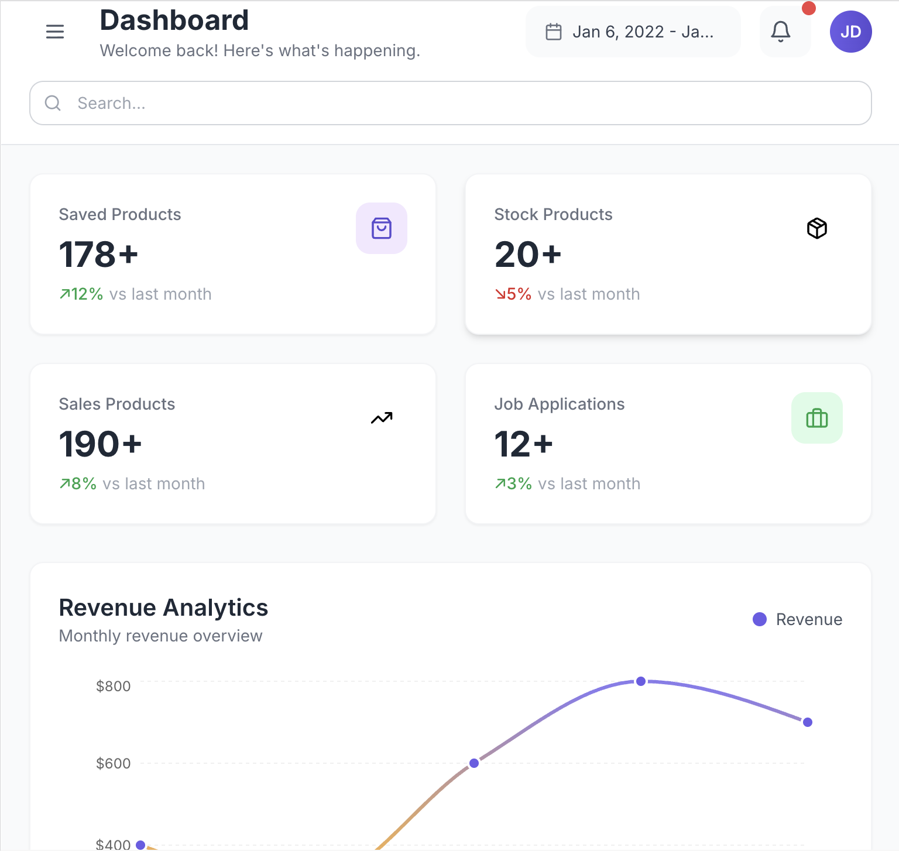
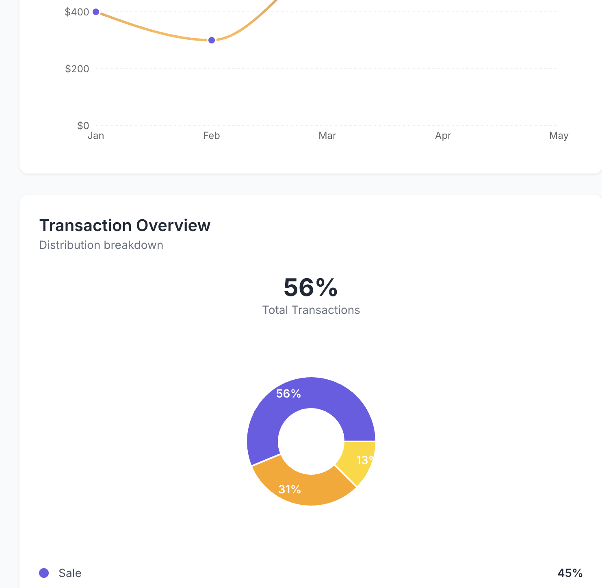
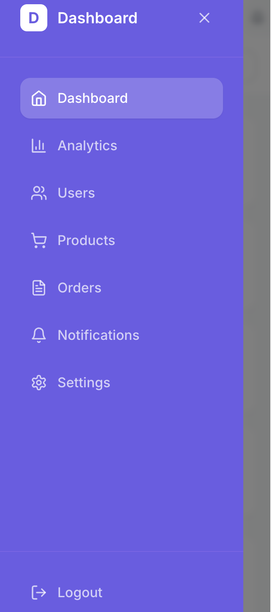
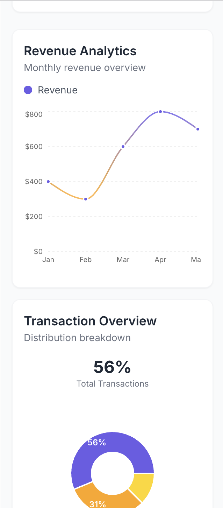
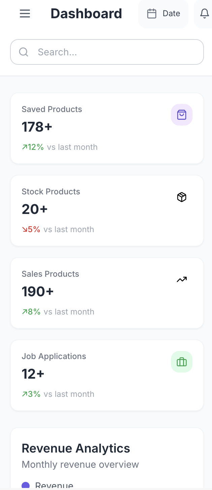
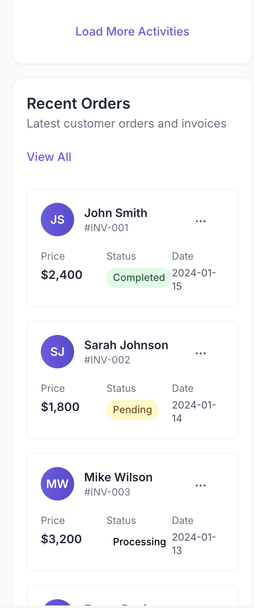

# Dashboard App

A modern, fully responsive dashboard application built with React, Vite, and Tailwind CSS. Features beautiful charts, analytics, and a clean user interface with accessibility-first design and purple color scheme.

## ✨ Features

- 📊 **Interactive Charts**: Line charts and donut charts using Recharts with responsive sizing
- 📱 **100% Responsive**: Fluid design from 320px to 1440px+ with touch-first mobile experience  
- ♿ **WCAG AA Compliant**: Full accessibility support with screen readers, keyboard navigation
- 🎨 **Modern UI**: Clean design with purple (#6C5CE7) color palette and smooth animations
- 📈 **Analytics Dashboard**: Summary cards, recent activities, and order management
- 🔍 **Search & Filters**: Responsive date picker and search functionality
- 🎯 **Real-time Data**: Dynamic data visualization with mobile-optimized tooltips

## 📸 Screenshots

Explore the responsive design across different devices to see how the dashboard adapts to various screen sizes.

### Desktop Views
<div align="center">
  <a href="./assets/desktop1.png"></a>
  <a href="./assets/desktop2.png"></a>
</div>
<p align="center"><em>Desktop experience with full sidebar navigation and multi-column layout</em></p>

### Tablet Views
<div align="center">
  <a href="./assets/tablet1.png"></a>
  <a href="./assets/tablet2.png"></a>
</div>
<p align="center"><em>Tablet experience with drawer navigation and optimized chart layouts</em></p>

### Mobile Views
<table>
  <tr>
    <td><a href="./assets/mobile1.png"></a></td>
    <td><a href="./assets/mobile2.png"></a></td>
  </tr>
  <tr>
    <td><a href="./assets/mobile3.png"></a></td>
    <td><a href="./assets/mobile4.png"></a></td>
  </tr>
</table>
<p align="center"><em>Mobile experience with touch-first design and card-based layouts</em></p>

## 📱 Responsive Strategy

### Breakpoints (Tailwind)
- **sm**: 640px+ (Mobile landscape, small tablets)
- **md**: 768px+ (Tablets, collapsed sidebar becomes visible)
- **lg**: 1024px+ (Desktop, full sidebar with labels)
- **xl**: 1280px+ (Large desktop, optimized spacing)
- **2xl**: 1536px+ (Ultra-wide displays)

### Layout Adaptations
- **Mobile (320px-767px)**:
  - Hidden sidebar with drawer overlay (touch-friendly 44px targets)
  - Single-column layout for all sections
  - Cards replace table view for orders
  - Stacked mobile search below header
  - Vertical date/time layout in activities

- **Tablet (768px-1023px)**:
  - Icon-only sidebar (18/4.5rem width)
  - 2-column layout for summary cards  
  - Charts stack vertically
  - Reduced chart heights for better scrolling

- **Desktop (1024px+)**:
  - Full sidebar with labels (88/22rem width)
  - Multi-column CSS Grid layouts (up to 12 columns)
  - Side-by-side charts and data sections
  - Hover states and larger interactive areas

### Mobile Navigation
- **Menu Button**: Tap hamburger icon in header to open sidebar
- **Drawer Pattern**: Sidebar slides in from left with backdrop blur
- **Auto-close**: Sidebar closes when selecting menu items on mobile
- **Keyboard**: ESC key closes the sidebar, focus management included

## 🎯 Accessibility Features

- **Keyboard Navigation**: Full Tab, Enter, ESC support throughout
- **Screen Reader**: Proper ARIA labels, landmarks, and semantic HTML
- **Focus Management**: Visible focus outlines with purple ring
- **High Contrast**: Support for prefers-contrast and color adjustments  
- **Reduced Motion**: Respects prefers-reduced-motion user preference
- **Touch Targets**: Minimum 44px touch targets on mobile devices
- **Alt Content**: Screen reader tables for chart data

## 🏗️ Components

### Layout Components
- **Sidebar**: Responsive navigation with mobile drawer pattern
- **Header**: Adaptive header with mobile menu button and responsive search
- **SummaryCard**: Fluid typography scaling with clamp() and trend indicators

### Data Visualization  
- **LineChart**: Revenue analytics with mobile-optimized dimensions and tooltips
- **PieChart**: Transaction donut chart with responsive legend and sizing
- **Activities**: Timeline feed with mobile-first stacked layout
- **OrdersTable**: Desktop table transforms to mobile cards below md breakpoint

## 🎨 Design System

### Color Palette
- **Primary Purple**: `#6C5CE7` (WCAG AA compliant)
- **Orange Accent**: `#FFA502`
- **Blue Accent**: `#1E90FF` 
- **Background**: `#F8FAFC`
- **Text Contrast**: Passes WCAG AA standards

### Typography
- **Font**: Inter (web font with system fallbacks)
- **Scaling**: CSS clamp() for fluid responsive text
- **Hierarchy**: Clear heading levels with proper contrast ratios

### Spacing & Layout
- **Container**: Responsive padding (16px → 24px → 32px)
- **Grid**: CSS Grid with responsive column counts
- **Gap**: Consistent 16px/24px spacing system

## 🚀 Installation

1. **Clone or download the project**
2. **Install dependencies:**
   ```bash
   npm install
   ```

3. **Start the development server:**
   ```bash
   npm run dev
   ```

4. **Open your browser and navigate to:**
   ```
   http://localhost:5173
   ```

## 📜 Available Scripts

- `npm run dev` - Start development server with hot reload
- `npm run build` - Build the project for production  
- `npm run preview` - Preview the built project locally
- `npm run lint` - Run ESLint for code quality

## 🛠️ Technologies Used

- **React 18** - Modern React with hooks and concurrent features
- **Vite** - Fast build tool and development server
- **Tailwind CSS** - Utility-first CSS framework with custom responsive utilities
- **Recharts** - Composable charting library with responsive containers
- **Lucide React** - Beautiful & consistent icon set with tree-shaking
- **Date-fns** - Modern JavaScript date utility library

## 📁 Project Structure

```
dashboard-app/
├── src/
│   ├── components/
│   │   ├── Sidebar.jsx          # Responsive navigation with drawer
│   │   ├── Header.jsx           # Adaptive header with mobile menu
│   │   ├── SummaryCard.jsx      # Responsive statistics cards
│   │   ├── LineChart.jsx        # Mobile-optimized revenue chart
│   │   ├── PieChart.jsx         # Responsive transaction donut chart
│   │   ├── Activities.jsx       # Timeline with mobile layout
│   │   └── OrdersTable.jsx      # Table → Cards responsive transformation
│   ├── App.jsx                  # Main app with responsive grid system
│   ├── main.jsx                 # React entry point
│   └── index.css               # Global styles, utilities, accessibility
├── index.html                   # HTML template with viewport meta
├── package.json                 # Dependencies and scripts  
├── tailwind.config.js          # Extended config with responsive utilities
├── postcss.config.js           # PostCSS configuration
├── vite.config.js              # Vite configuration
└── README.md                   # This comprehensive guide
```

## ⚙️ Customization

### Responsive Breakpoints
Modify breakpoints in `tailwind.config.js`:
```js
theme: {
  screens: {
    'sm': '640px',   // Mobile landscape
    'md': '768px',   // Tablet 
    'lg': '1024px',  // Desktop
    'xl': '1280px',  // Large desktop
    '2xl': '1536px', // Ultra-wide
  }
}
```

### Color Themes
Update the color palette while maintaining contrast ratios:
```js
colors: {
  primary: '#6C5CE7',    // Purple (ensure WCAG AA)
  orange: '#FFA502',     // Orange accent
  blue: '#1E90FF',       // Blue accent
}
```

### Chart Responsive Heights
Adjust chart dimensions in components:
```js
// Mobile: h-56 (224px), Desktop: h-80 (320px)
<div className="h-56 sm:h-72 lg:h-80 xl:h-96">
```

## 🧪 Testing Responsive Design

### Recommended Test Widths
- **320px** - Small mobile (iPhone SE)
- **375px** - Standard mobile (iPhone 12)  
- **414px** - Large mobile (iPhone Plus)
- **768px** - Tablet portrait (iPad)
- **1024px** - Tablet landscape / Small desktop
- **1280px** - Desktop
- **1440px** - Large desktop

### Validation Checklist
- ✅ No horizontal scrollbars at any width
- ✅ All interactive elements meet 44px touch target
- ✅ Charts resize properly and remain legible
- ✅ Table transforms to cards below md breakpoint  
- ✅ Sidebar drawer works smoothly on mobile
- ✅ Keyboard navigation flows correctly
- ✅ Screen reader announces content properly

## 🔧 Performance Optimizations

- **ResponsiveContainer**: Charts automatically resize without layout shift
- **CSS Grid**: Hardware-accelerated responsive layouts
- **Tree Shaking**: Only imports used Lucide icons  
- **Reduced Motion**: Respects user motion preferences
- **Print Styles**: Clean printing with .no-print utilities

## 🌐 Browser Support

- **Chrome 90+** (recommended)
- **Firefox 88+** 
- **Safari 14+**
- **Edge 90+**
- **Mobile Safari iOS 14+**
- **Chrome Mobile Android 90+**

## 🤝 Contributing

This project follows accessibility best practices. When contributing:

1. Test on multiple screen sizes (320px - 1440px+)
2. Verify keyboard navigation works correctly  
3. Check color contrast meets WCAG AA standards
4. Test with screen readers when possible
5. Ensure touch targets meet 44px minimum

## 📄 License  

This project is open source and available under the [MIT License](LICENSE).